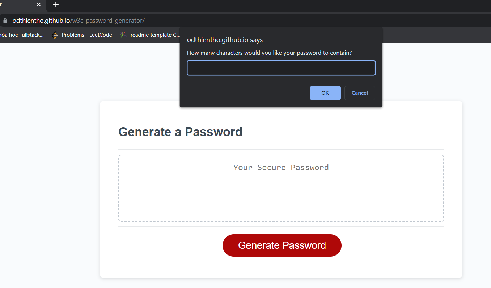
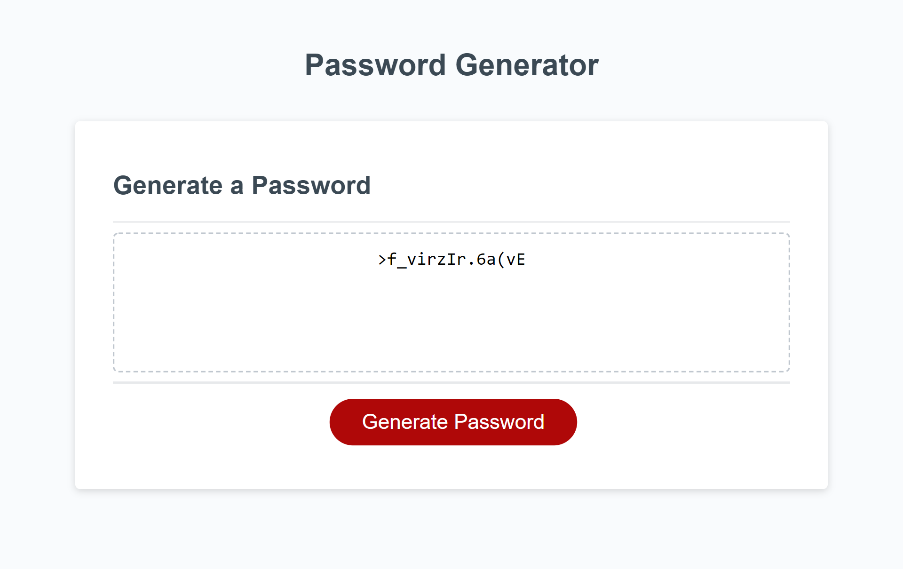

# Password Generator

## About The Project

The web application helps to generate random passwords based on certaub criterias: length, lowercase, uppercase, numeric or special characters. This app runs in web browser with the responsive user interface that adapts to multiple screen sizes.

## Features

```
-  When user click on Generate Password button, the app will promt to ask different criterias for password

-  Password has to be at least than 8 characters and no more than 128 characters
 The app will make sure user to input the right type (number) and correct value.

-  Users will be able to choose whether they want to include lowercase, uppercase, numeric, and/or special characters.

-  Password will be randomly generated through Javascript random method.

-- Password will be displayed in the textarea of the page
```

## Deployment
Please follow [https://odthientho.github.io/w3c-password-generator](https://odthientho.github.io/w3c-password-generator/) to the deployed Password Generator site.

## Screenshots




